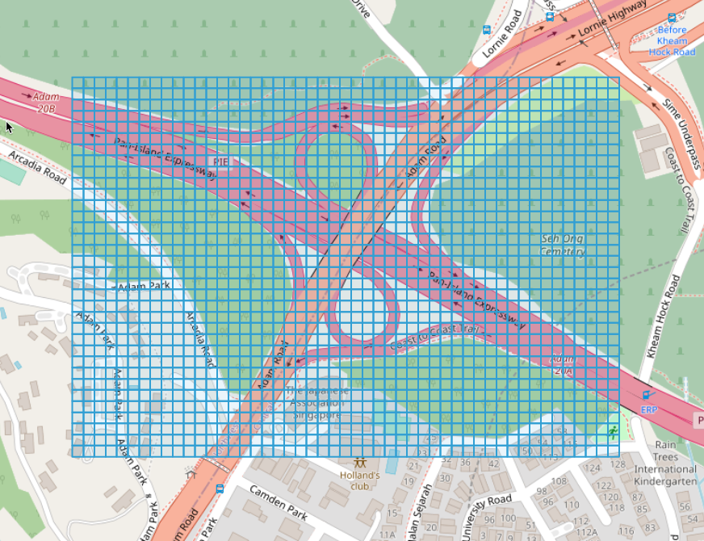

# gen-grids
gen-grids generates grids covering the given boundary box, and output the results to geojson file.

## usage
```
usage: gen-grids --minlat=MINLAT --minlon=MINLON --maxlat=MAXLAT --maxlon=MAXLON --out=OUT [<flags>]

Flags:
  -h, --help           Show context-sensitive help (also try --help-long and --help-man).
      --minlat=MINLAT  min lat
      --minlon=MINLON  min lon
      --maxlat=MAXLAT  max lat
      --maxlon=MAXLON  max lon
      --size-lat=0.00012874603269
                       grid size: height(lat)
      --size-lon=0.00012874603269
                       grid size: width(lon)
      --out=OUT        output file
```

for example,
```shell
$gen-grids --minlat=1.29200559 --minlon=103.81626719 --maxlat=1.30073960 --maxlon=103.83267501 --size-lat=0.00012874603269 --size-lon=0.00012874603269 --out=example.geojson
```
[example](/example.geojson)

