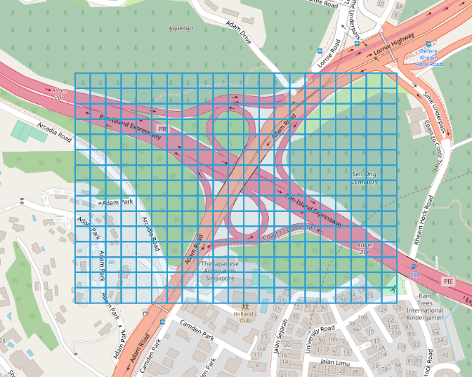

# gen-grids
gen-grids generates grids covering the given boundary box, and outputs the result to geojson file.

## usage
```
usage: gen-grids --minlat=MINLAT --minlon=MINLON --maxlat=MAXLAT --maxlon=MAXLON --gridsize-lat=GRIDSIZE-LAT --gridsize-lon=GRIDSIZE-LON --out=OUT [<flags>]

Flags:
  -h, --help           Show context-sensitive help (also try --help-long and --help-man).
      --minlat=MINLAT  min lat
      --minlon=MINLON  min lon
      --maxlat=MAXLAT  max lat
      --maxlon=MAXLON  max lon
      --gridsize-lat=GRIDSIZE-LAT
                       grid size: height(lat)
      --gridsize-lon=GRIDSIZE-LON
                       grid size: width(lon)
      --out=OUT        output file
```

for example,
```shell
$gen-grids --minlat=1.32998759 --minlon=103.81319278 --maxlat=1.33427187 --maxlon=103.81946325 --gridsize-lat=0.0003 --gridsize-lon=0.0003 --out=example.geojson
```
[example](/example.geojson)\

